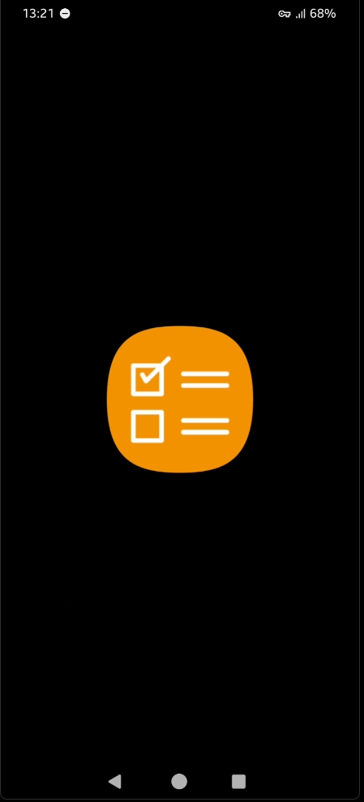
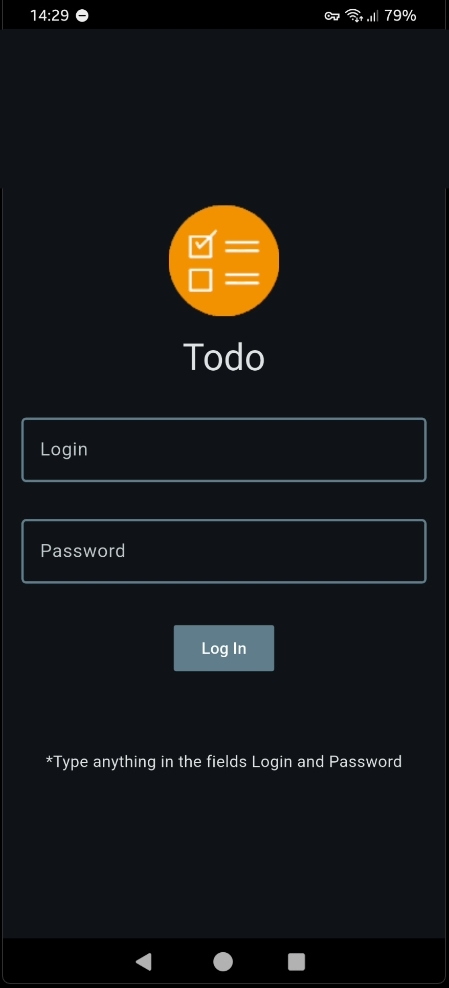
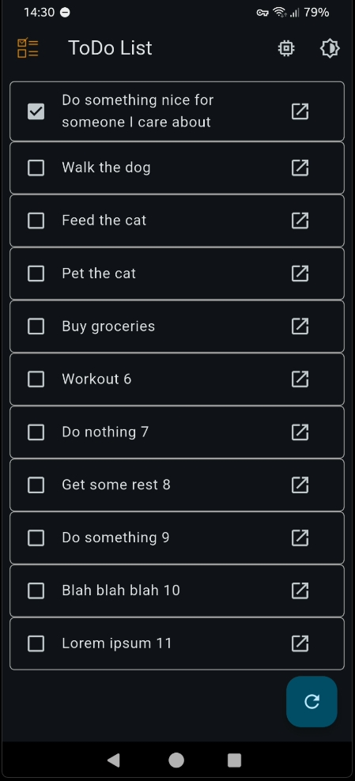
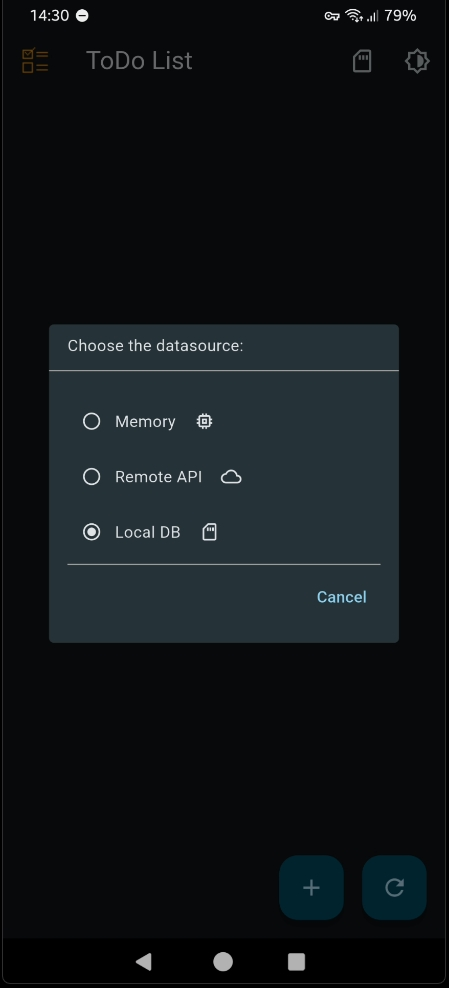
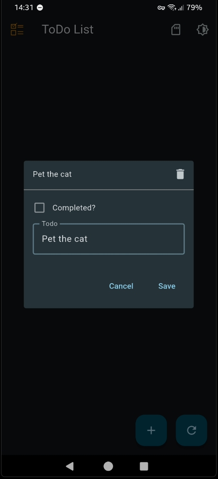
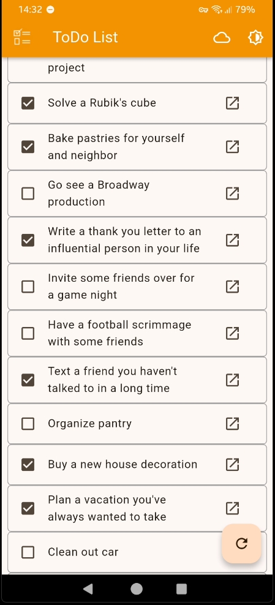

# Flutter-Todo

A robust, yet simple, Flutter project demonstrating an almost fully-featured Todo application. This app is designed to showcase modern development practices and sound architecture within the Flutter ecosystem.

### Key Features & Technical Highlights
This project adheres to current best practices, focusing on maintainability, scalability, and testability:

- State Management: Utilizes the ChangeNotifier, the officially recommended approach for state management by the Flutter team.
- Architecture: Implements the MVVM (Model-View-ViewModel) pattern, incorporating principles of Clean Architecture for clear separation of concerns and layered design.
- Dependency Injection: Uses GetIt for service location and robust dependency injection, decoupling services from the UI layer.
- Dynamic Theming: Full support for seamless theme switching:
  - Light Mode
  - Dark Mode
  - System-Defined Theme
- Dynamic Data Source Management: The application's architecture allows for switching between different data persistence layers:
  - Local Persistence: Uses SQLite for secure, local storage on the device.
  - Remote API Access: Demonstrates HTTP communication by consuming a public mock API (e.g., DummyJson) for remote data retrieval and display.
  - In-Memory Mocking: Provides in-memory data simulation (Mocking) for quick testing and development when database or API access is not required.
- UI Adaptation: The user interface dynamically adjusts permissions and functionalities based on the selected data source (e.g., disabling the 'Add' button if the read-only remote API is selected).
- The app also uses Get-It for dependecy injection

 

&emsp;&emsp;&emsp;

&emsp;&emsp;&emsp;

&emsp;&emsp;&emsp;

&emsp;&emsp;&emsp;

&emsp;&emsp;&emsp;

